# Efficient Processing of Events Using Container Apps in Azure

Mystique Enterprises operates multiple web stores that generate a significant number of events related to sales and inventory. These events need to be processed in a timely and efficient manner. Mystique Enterprises is exploring the use of container apps to handle the event processing workload, enabling scalability and performance optimization. They seek a solution that allows them to seamlessly process store events, while ensuring data integrity and compliance. The goal is to streamline the event processing workflow and achieve faster, reliable, and cost-effective processing of store events without spending time and effort on infrastructure management.

Can you provide guidance on how to accomplish this?

## 🎯 Solution

To achieve efficient processing of events, Mystique Enterprises can utilize Azure Service Bus for reliable event messaging. They can containerize their event processing logic using Container Apps and store the container images in Azure Container Registry. The events can be persisted in Blob storage and Cosmos DB for data storage and management. To ensure secure and controlled access to resources, a Managed Identity can be used. Monitoring for metrics and performance can be implemented using Azure Monitor. This solution enables seamless event processing, scalability, data integrity, and compliance for Mystique Enterprises.

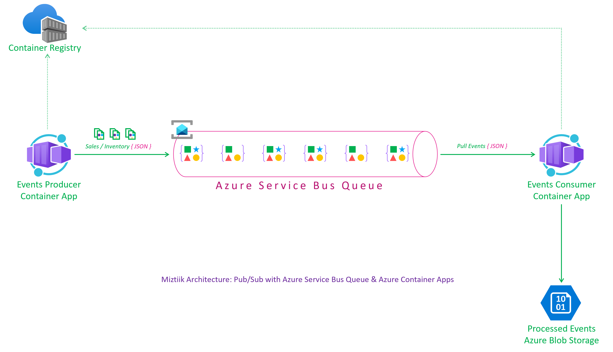

1. ## 🧰 Prerequisites

   This demo, along with its instructions, scripts, and Bicep template, has been specifically designed to be executed in the `northeurope` region. However, with minimal modifications, you can also try running it in other regions of your choice (the specific steps for doing so are not covered in this context)

   - 🛠 Azure CLI Installed & Configured - [Get help here](https://learn.microsoft.com/en-us/cli/azure/install-azure-cli)
   - 🛠 Azure Function Core Tools - [Get help here](https://learn.microsoft.com/en-us/azure/azure-functions/functions-run-local?tabs=v4%2Cwindows%2Ccsharp%2Cportal%2Cbash#install-the-azure-functions-core-tools)
   - 🛠 Bicep Installed & Configured - [Get help here](https://learn.microsoft.com/en-us/azure/azure-resource-manager/bicep/install)
     - 🛠 [Optional] VS Code & Bicep Extenstions - [Get help here](https://learn.microsoft.com/en-us/azure/azure-resource-manager/bicep/install#vs-code-and-bicep-extension)
   - `jq` - [Get help here](https://stedolan.github.io/jq/download/)
   - `bash` or git bash - [Get help here](https://git-scm.com/downloads)

2. ## ⚙️ Setting up the environment

   - Get the application code

     ```bash
     git clone https://github.com/miztiik/azure-container-app-event-processor.git
     cd azure-container-app-event-processor
     ```

3. ## 🚀 Prepare the local environment

   Ensure you have jq, Azure Cli and bicep working

   ```bash
   jq --version
   func --version
   bicep --version
   bash --version
   az account show
   ```

4. ## 🚀 Deploying the Solution

   - **Stack: Main Bicep**
     We will create the following resources
     - **Storage Accounts** for storing the events
       - General purpose Storage Account - Used by Azure functions to store the function code
       - `warehouse*` -  Azure Function will store the events data in this storage account
     - **Managed Identity**
        - This will be used by the Azure Function to interact with other services
     - **Azure Cosmos DB**
        - This will be used by the Azure Function to store the events data
     - **Azure Service Bus Queue**
        - A namespace and a queue will be created. The Azure container apps will use this queue to publish and retrieve events
     - **Azure Container Registry**
        - To host the producer and consumer container images
        - The build scripts at `app/container_builds/event_processor_for_svc_bus_queues/build_and_push_img.sh` will build the container images and push them to ACR.
        - To streamline the deployment process <ins>without</ins> using DevOps pipelines, the container image needs to be built locally and pushed to ACR using the above script. However, this approach requires separate deployment of the container apps, which will be addressed in the next iteration. It's important to note that the initial deployment will <ins>fail</ins> due to missing images. Once the images are available, redeploy the main stack for a successful deployment.
     - **Container Apps**
        - **Producer**: Python Flask app with two routes 
          - `/` for index page - Will be used for health check and readiness probes
          - `/event-producer` customized to generate events and ingest them to service bus. The number of event to produce with each request can be configured through environment variable `TOT_MSGS_TO_PRODUCE` defaults to `15`
        - **Consumer**: Python Flask app with two routes 
          - `/` for index page - Will be used for health check and readiness probes
          - `/event-consumer` customized to consume events from service bus and store them in cosmos db. The number of event to consume with each request can be configured through environment variable `MAX_MSGS_TO_PROCESS` defaults to `10`
        - **Note**: The container apps are configured to use the managed identity to access other resources. The managed identity is configured to have access to the service bus queue, storage account and cosmos db. To get this to work the environment variable `AZURE_CLIENT_ID` needs to be setup with the managed identity client id.

      Initiate the deployment with the following command,

      ```bash
      # make deploy
      sh deployment_scripts/deploy.sh
      ```

      After successfully deploying the stack, Check the `Resource Groups/Deployments` section for the resources.

5. ## 🔬 Testing the solution

   - **Trigger the Event Producer function**

      ```bash
      PRODUCER_URL="https://c-app-event-producer-ne-007.mangodesert-5dd578ef.northeurope.azurecontainerapps.io/event-producer"
      for i in {1..10}
      do
      echo "Sending event batch $i"
      curl $PRODUCER_URL &
      sleep 5
      done
      ```

      You should see an output like this, We are sending batch of events every `5` seconds.

      ```json
      Sending event batch 1
      [1] 2814
      Sending event batch 2
      [2] 2816
      Sending event batch 3
      [3] 2818
      Sending event batch 4
      ...
      ```

      As we are batching the upload of telemetry data to application insights, It takes few minutes for the data to show up there. You can check the `Live Metrics` section of the `store-events-producer-fn` function app. 

      
      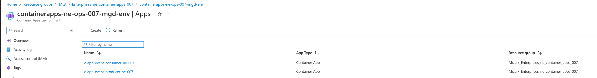
      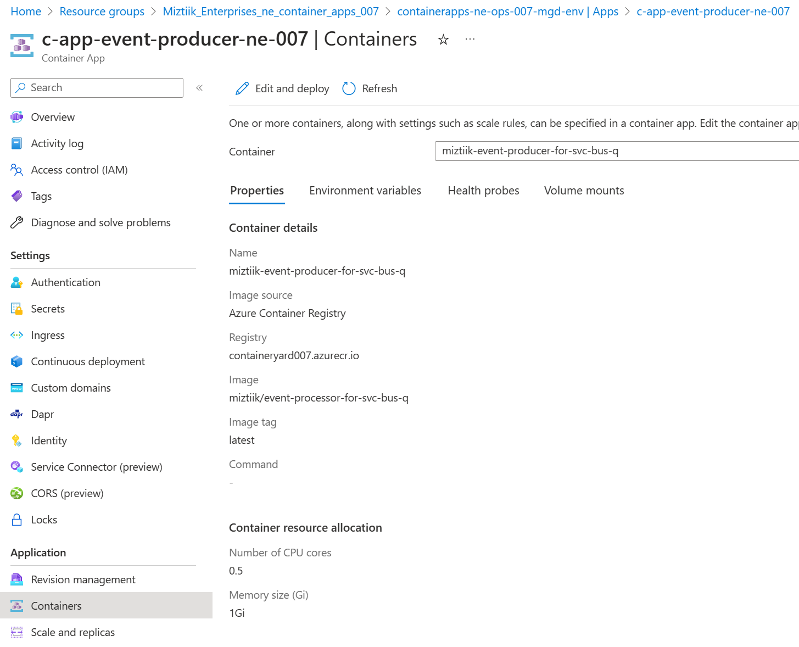
      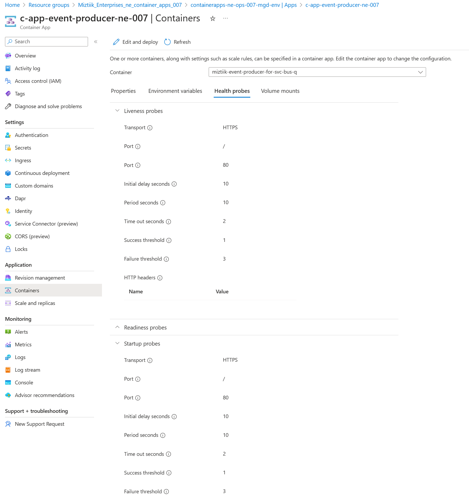
      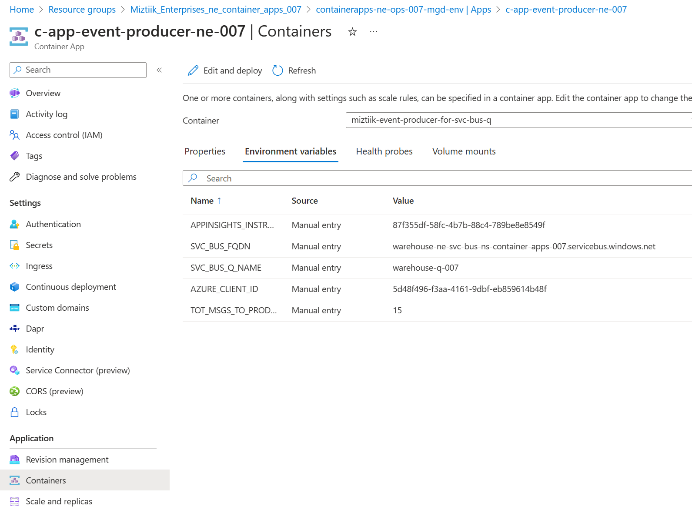
      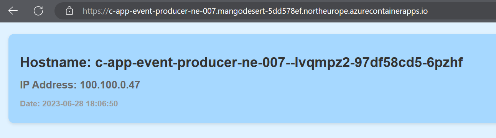
      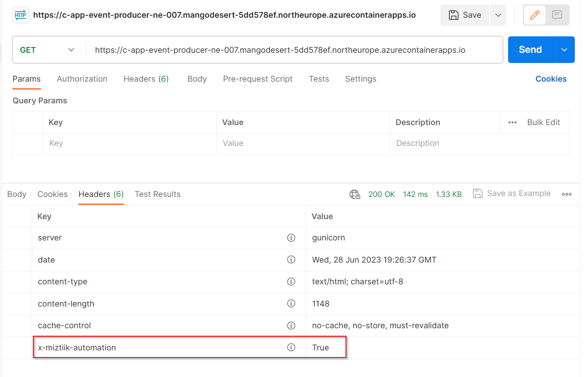
      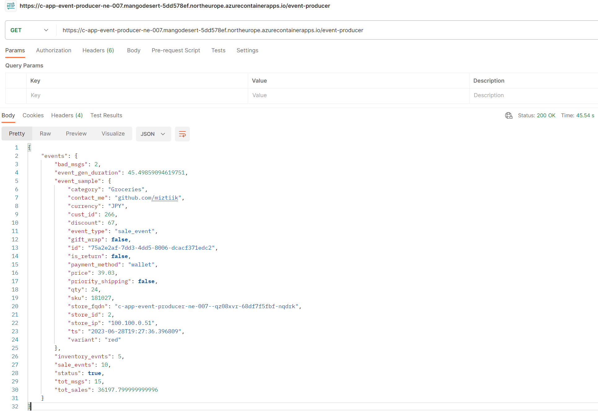

   - **Trigger the Event Consumer function**
      ```bash
      CONSUMER_URL="https://c-app-event-consumer-ne-007.mangodesert-5dd578ef.northeurope.azurecontainerapps.io/event-consumer"
      for i in {1..10}
      do
      echo "Receive event batch $i"
      curl $CONSUMER_URL &
      sleep 5
      done
      ```     

      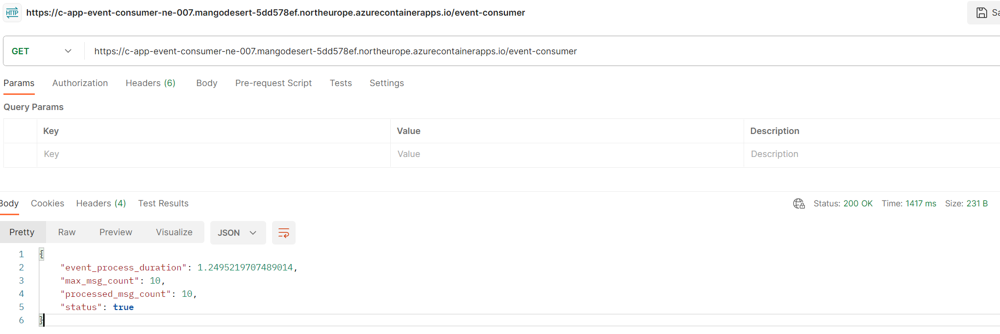
      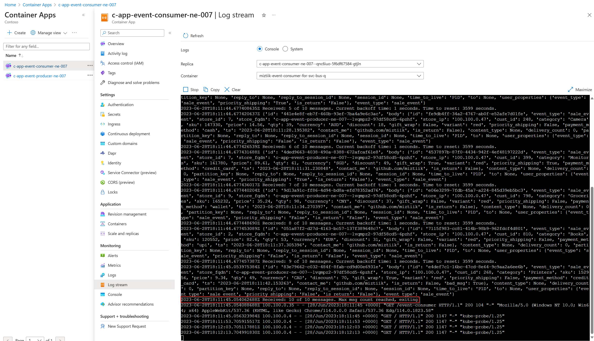
      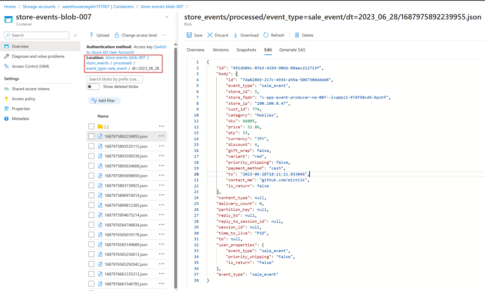
      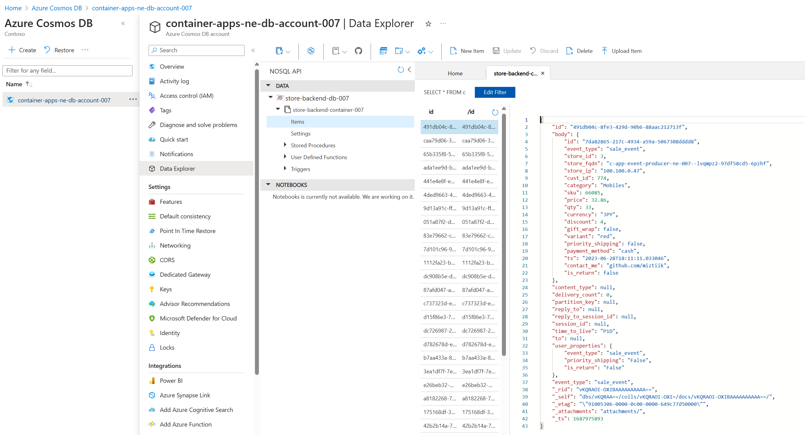

6. ## 📒 Conclusion

    In conclusion, this blog highlights the benefits of using container apps in Azure for efficient event processing. By leveraging containerization and Azure services, such as Azure Service Bus, Container Registry, Blob, and Cosmos, Miztiik Enterprises can streamline their event processing workflow, ensuring scalability, reliability, and cost-effectiveness. The use of managed identity and monitoring for metrics further enhances the security and observability of the containerized solution. With this approach, Miztiik Enterprises can optimize their event-driven architecture, achieve faster processing of store events, and eliminate the need for manual infrastructure management.
  
7. ## 🧹 CleanUp

   If you want to destroy all the resources created by the stack, Execute the below command to delete the stack, or _you can delete the stack from console as well_

   - Resources created during [Deploying The Solution](#-deploying-the-solution)
   - _Any other custom resources, you have created for this demo_

   ```bash
   # Delete from resource group
   az group delete --name Miztiik_Enterprises_xxx --yes
   # Follow any on-screen prompt
   ```

   This is not an exhaustive list, please carry out other necessary steps as maybe applicable to your needs.

## 📌 Who is using this

This repository aims to show how to Bicep to new developers, Solution Architects & Ops Engineers in Azure.

### 💡 Help/Suggestions or 🐛 Bugs

Thank you for your interest in contributing to our project. Whether it is a bug report, new feature, correction, or additional documentation or solutions, we greatly value feedback and contributions from our community. [Start here](/issues)

### 👋 Buy me a coffee

[](https://ko-fi.com/Q5Q41QDGK) Buy me a [coffee ☕][900].

### 📚 References

1. [Azure Docs - Data Collection Basics of Azure Monitor Application Insights][2]
1. [Azure Docs - Push your first image to your Azure container registry using the Docker CLI][3]

[2]: https://learn.microsoft.com/en-us/azure/azure-monitor/app/opentelemetry-overview
[3]: https://learn.microsoft.com/en-us/azure/container-registry/container-registry-get-started-docker-cli?tabs=azure-cli

### 🏷️ Metadata


**Level**: 200

[100]: https://www.udemy.com/course/aws-cloud-security/?referralCode=B7F1B6C78B45ADAF77A9
[101]: https://www.udemy.com/course/aws-cloud-security-proactive-way/?referralCode=71DC542AD4481309A441
[102]: https://www.udemy.com/course/aws-cloud-development-kit-from-beginner-to-professional/?referralCode=E15D7FB64E417C547579
[103]: https://www.udemy.com/course/aws-cloudformation-basics?referralCode=93AD3B1530BC871093D6
[899]: https://www.udemy.com/user/n-kumar/
[900]: https://ko-fi.com/miztiik
[901]: https://ko-fi.com/Q5Q41QDGK